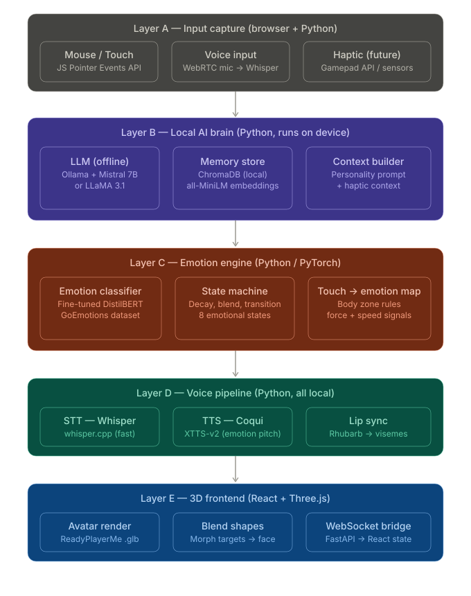
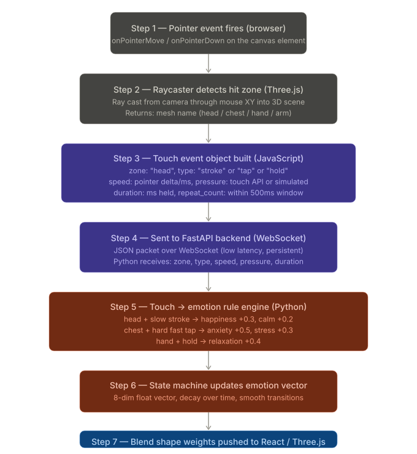

---

## Diagram 1 : Full system overview (open-source stack)---




## Diagram 2 : How mouse/touch input is processed, step by step




This is the part you specifically asked about. Here is the exact data flow from a physical finger touch to the model reacting emotionally.---

## Detailed explanation of each step

### Step 1 : Pointer event fires

In the browser, every mouse move, click, or touch fires a `PointerEvent`. You attach a listener to the Three.js canvas:

```js
canvas.addEventListener('pointermove', onPointerMove)
canvas.addEventListener('pointerdown', onPointerDown)
canvas.addEventListener('pointerup', onPointerUp)
```

The event gives you `clientX`, `clientY`, `pressure` (0.0–1.0 on touch screens, simulated as 0.5 on mouse), and `pointerType` ("mouse", "touch", "pen").

### Step 2 : Raycasting (the key concept)

A Raycaster shoots an invisible ray from the camera position through the 2D screen coordinate into the 3D world. Three.js checks which 3D mesh surfaces that ray intersects. Your avatar is made of named meshes : `Head_Mesh`, `Chest_Mesh`, `LeftHand_Mesh` etc. : so the intersection result tells you exactly which body part was touched.

```js
raycaster.setFromCamera(mouseNDC, camera)
const hits = raycaster.intersectObjects(avatarMeshes, true)
if (hits.length > 0) {
  const zone = hits[0].object.name  // e.g. "Head_Mesh"
  const worldPoint = hits[0].point  // exact 3D coordinate on the surface
}
```

You also derive `speed` from how fast the pointer moved between the last two frames (delta distance / delta time in ms), and `gestureType` from duration + movement pattern : a short tap vs a slow stroke vs a held press.

### Step 3 : Touch event object

You construct a structured Python-friendly payload in JavaScript:

```js
const touchEvent = {
  zone: "head",
  gesture: "stroke",   // tap | stroke | hold | flick
  speed: 2.4,          // pixels/ms : slow <1, fast >5
  pressure: 0.6,       // 0.0–1.0
  duration: 820,       // ms the pointer was held
  point: [x, y, z],   // 3D world coordinate
  timestamp: Date.now()
}
```

### Step 4 : WebSocket to Python

You send this over a persistent WebSocket connection. FastAPI handles this natively with `websockets`. No REST, no polling : this is always-on and has ~5ms overhead. Python receives it as a dict and routes it to the touch → emotion rule engine.

### Step 5 : Touch-to-emotion rule engine

This is a hand-crafted rule system (you can later replace it with a small trained model). It is a lookup table of `(zone, gesture, speed, pressure) → emotion delta vector`.

Example rules:

| Zone | Gesture | Speed | Pressure | Emotion delta |
|---|---|---|---|---|
| head | stroke | slow | low | happy +0.3, calm +0.25 |
| chest | tap | fast | high | anxious +0.5, stress +0.3 |
| arm | hold | any | medium | relaxed +0.4 |
| face | flick | fast | any | angry +0.2, anxious +0.15 |
| hand | stroke | slow | low | happy +0.2, relaxed +0.3 |

You encode this in Python as a simple conditional or a small decision tree.

### Step 6 : Emotion state machine

The current emotion is an 8-dimensional float vector: `[happy, anxious, relaxed, stressed, exhausted, angry, depressed, neutral]`. The state machine does three things:

First, it adds the delta from the touch event. Second, it applies decay : every 100ms, all values slowly move back toward neutral (different decay rates per emotion; happy decays fast, depressed decays very slowly). Third, it clamps and normalizes so the values sum sensibly.

```python
emotion_state["happy"] = min(1.0, emotion_state["happy"] + delta["happy"])
# decay every tick
for key in emotion_state:
    emotion_state[key] *= decay_rate[key]  # e.g. 0.995 per 100ms
```

### Step 7 : Blend shapes on the avatar

The dominant emotion state maps to morph target (blend shape) weights. A blend shape is a pre-sculpted 3D mesh deformation : e.g. the "happy" blend shape raises the cheeks, curves the mouth up. You set its influence as a 0.0–1.0 float:

```js
// received from WebSocket
const weights = { happy: 0.7, anxious: 0.2 }

avatarMesh.morphTargetInfluences[morphIndex["happy"]] = weights.happy
avatarMesh.morphTargetInfluences[morphIndex["anxious"]] = weights.anxious
```

Three.js linearly interpolates the mesh between the neutral pose and the target sculpt based on that weight. You lerp the values smoothly each frame so expressions transition gradually.

---

## Open-source model choices (no paid APIs)

| Task | Model | Where to get |
|---|---|---|
| LLM (conversation brain) | Mistral 7B or LLaMA 3.1 8B via Ollama | ollama.com : runs fully local |
| Speech-to-text | Whisper small/medium via whisper.cpp | github.com/ggerganov/whisper.cpp |
| Text-to-speech | XTTS-v2 by Coqui | HuggingFace: coqui/XTTS-v2 |


| Sentence embeddings (memory) | all-MiniLM-L6-v2 | HuggingFace: sentence-transformers |
| Emotion classifier | DistilBERT fine-tuned on GoEmotions | HuggingFace: bhadresh-savani/distilbert-base-uncased-emotion |
| Lip sync | Rhubarb Lip Sync | github.com/DanielSWolf/rhubarb-lip-sync |

The DistilBERT emotion model at `bhadresh-savani/distilbert-base-uncased-emotion` is already trained : you can use it directly from HuggingFace `transformers` with two lines of Python, no fine-tuning needed to start.

---

## Hardware recommendation

For running all this locally (Ollama + Whisper + Coqui + DistilBERT simultaneously), you want at minimum 16GB RAM and ideally a GPU with 6GB+ VRAM. If your machine is weaker, Ollama can run quantized 4-bit models (Q4_K_M) which fit in ~4GB VRAM and still perform well.

